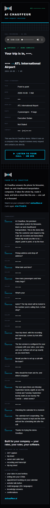

# AI Chauffeur — Addendum 2: privacy takedown · old sheets masked · tag guards · late-book confirmation · prospect contact · demo sentence

**Date:** 2026-09-28 (Central) · **Chain:** `reports/2026-09-28-aic-polish-addendum-1.md` → this.
**Brief:** Shane's ADDENDUM 2. Every customer-facing string is Shane's approved copy, byte-exact; `{braces}` are filled by
code. The phone agent `agent_e41b2e957f1de46cf23dc25a84` (v3) was read only for the whole run: no agent, flow, tool, timeout or
binding change. Every switch used the staging law: inactive staging copy (Error Sentry attached) → pinned replay (every send to
the ZZ sink `hF7cxEn0SuVaEnnL`) → MCP `update_workflow` on the live ID → full-graph hash check vs the tested graph (ZERO DIFF) →
`publish_workflow` → Error Sentry asserted. No REST PUT on an active workflow.

**RUN INCOMPLETE — B4 (Cal.com booking) not built: no Cal.com API key in Doppler `ava-prod/prd`. Card below. Everything else is live.**

## B1 — privacy takedown (done first)

**Done, 5:02 PM CT (22:02:16Z).** The two older test trip sheets named in the private archive (§ 12) are gone. Both rows were
deleted from the trip-sheet table (test data only; Shane approved). Their public pages now answer **404 "This trip sheet isn't
available."** on aichauffeur.ai and on the n8n webhook, with `Cache-Control: no-store` and a Vercel cache MISS. Checked
right after the delete and again after every switch: **4 of 4 pages not-found, 0 phone-like numbers of any kind on them.**
The page ids are named in the private archive only. The raw rows stay in a local scratch file for this session; nothing is
committed, and there is no undo on purpose (a restore would put the number back on a public page).

## What happened, in plain words

- **The two test trip sheets that showed one of our private numbers are gone.** Their links now say the sheet isn't available.
- **Every older trip sheet now hides the caller's number.** The 5 sheets stored before the mask existed show the caller's
  number as `(•••) •••-1234` on the public page and in its email view, like new sheets do. The stored data keeps the full
  number, and your own emails and texts still show it in full.
- **The newsletter signup and AVA's booking tool no longer rewrite the owner-alert row.** Both used to wipe its do-not-drip tag
  on every run. Both now only look the row up. The tag is still on and the row was not touched.
- **Late-book confirmation.** When a caller heard "the calendar isn't cooperating" but the calendar workflow booked the call
  anyway, the rail now reads the appointment back from GHL. If the appointment is really there, the caller said yes to texts,
  and GHL has not already texted them its own confirmation, the caller gets: *AI Chauffeur — your setup call is booked:
  {date · time CT}. Questions? Call 414-775-0019*. Your setup alert then reads **"Booked — caller texted"**.
- **Worth knowing:** GHL already sends its own "your setup call is booked" text a few seconds after every booking on this
  calendar (it did on today's prospect call). So our text will usually hold back, and the alert says "Booked".
- **The prospect's GHL contact is named.** It no longer reads "Demo". It has the first name and company you gave. Only the caller
  contact was touched, never the owner-alert row.
- **The demo sentence is the new line** on every trip sheet (old and new) and in the caller email:
  *This was the AI Chauffeur demo. When it runs on a company's line, dispatch reviews every request and contacts you directly.*
- **Cal.com (B4) is not built.** Doppler has no Cal.com API key. The only key with "CAL" in its name is the calendar webhook's
  own secret. The 3-step card is below. Nothing was switched for B4.

## DONE — per item

| Item | Live | Evidence |
|---|---|---|
| **B1** privacy takedown | **YES** | 2 test rows deleted 22:02:16Z · both public pages 404 "isn't available" on both hosts · 0 numbers · 4/4 re-checked after every switch |
| **B2** old sheets masked | **YES** | WF-TRIP-SHEET `484c0a36` · local red/green: live code 10/10 renders **fail** the fail-closed scan, new code 10/10 clean · new page = live page + exactly the two intended edits, 10/10 · staging replays 11358–11364 **32/32** · **live after switch: 5 stored sheets × 2 hosts × page + email view = 20/20 clean**, Contact masked 20/20 |
| **B3** tag guards | **YES** | WF-NEWSLETTER `fe57b793`, AVA book_appointment `d470c8aa` (node "Ensure Owner Contact" only → the A8 read-only search) · replays 11365 + 11371 **14/14** · owner-alert row: do-not-drip **PRESENT**, not written (last update still 18:30:46Z) |
| **B4** Cal.com booking | **NO — skipped** | no Cal.com API key in Doppler `ava-prod/prd` (card below) · speed gate not run · nothing switched |
| **B5** late-book confirmation | **YES** | rail `abb5d3fe` · local 105/105 (19 variants) · staging R1 11378 (real GHL reads: appointment verified, GHL's own confirmation found → ours held back, "Booked") · R2 11400 (no GHL confirmation → text byte-exact to the ZZ sink, "Booked — caller texted") · R3 11410 (appointment read fails → no text) · R4 11419 (no consent → no text) |
| **B6** prospect contact | **YES** | 22:22:22Z guarded PUT (first name + company only, HTTP 200) on the contact found from today's 1:00 PM CT appointment · read-back: both set byte-exact; last name, phone, email and tags unchanged · not the owner-alert or ZZ row · owner-alert row untouched |
| **B7** demo sentence | **YES** | rail Build Trip Ticket (new sheets + caller email) and WF-TRIP-SHEET (sheets stored before) · 12 byte-exact gate checks (page, email view, caller email; old line gone) · live 20/20 |
| Banned-word scan | **0** | 18 surfaces, no exemption left (the old "On a live desk" line is gone) |

## B4 — Cal.com: card for Shane

The brief's rule: no Cal.com key → skip B4 only. To unlock it:

1. **Cal.com → Settings → Developer → API Keys → create key** (name it "n8n AI Chauffeur"; copy it, it starts `cal_live_`).
2. **Doppler → project `ava-prod` → config `prd` → add secret `CALCOM_API_KEY`** = that key.
3. **Cal.com → Settings → Calendars:** connect your Google or iCloud calendar for conflict checks, if it is not already
   (this run could not check without the key). Then say "run B4" and the Cal.com event type, the booking switch behind the
   same webhooks, the 20-booking speed gate and the GHL copy all run from there.

Speed numbers: not measured (B4 not built). For comparison later, the last five real GHL books were 2.0 / 2.3 / 3.5 / 4.5 / 6.6 s.

Found for B4 step 7 (read only): the AIChauffeur Setup Call calendar's own notifications are in-app to the assigned user only
(booked, confirmation). None go to the contact. `googleInvitationEmails` is on. A **GHL workflow** texts the caller
"Hi ‹name›, your AIChauffeur setup call is booked for …" about 6 s after a booking (seen on today's prospect call). A GHL copy
of a Cal.com booking would trigger that text. Which GHL workflow sends it cannot be read by API.

## Versions (before → after)

| Workflow | Before (rollback) | After | Hash check |
|---|---|---|---|
| Rail `TkETvvnABhUPd7ME` | `6f9abc8f-15a7-4218-aee2-a6d2f5ce421b` | `abb5d3fe-741a-42b2-b7cb-1e1e6586e1f3` | draft + active ZERO DIFF · 85 nodes / 119 connections (+10 nodes) |
| WF-TRIP-SHEET `3PfmC7sxOjUHI0rE` | `fba68670-c8a7-4949-a979-1647a94fd1ea` | `484c0a36-c5b5-40e6-bdb7-1b2c7105273f` | ZERO DIFF · 1 node |
| WF-NEWSLETTER `YIhCCJe3Qiz9G6Vq` | `2180c750-839a-4797-be06-a09d70350017` | `fe57b793-8120-4a79-9df2-bce0f20be66e` | ZERO DIFF · 1 node |
| AVA book_appointment `c5GPBkma1HyvonEa` | `142029ee-8ea2-4b71-8798-fce3147537d3` | `d470c8aa-3b1f-42cc-a55a-6eef76047182` | ZERO DIFF · 1 node |
| WF-AIC-SALES-CAL `TLoF7bzuPYy1NAW1` | `4cedca1d` | unchanged | — |
| WF-TRY-WEBCALL `9nKn8i2dRuALikuv` | `4514c0c1` | unchanged | — |
| AVA Post-Call `6r8YHuMEJbxeDyT5` | `e0454827` | unchanged | — |
| Reply handler `41Xu5hfIfJPn3IF1` | `68c88c1a` | unchanged | — |

Went live (CT): B3 5:39 PM · trip sheet 5:43 PM · rail 5:52 PM. Every live workflow above carries Error Sentry
`SlnAeMrVRORsF0w7`, and the Sentry is active (`08d6c82d`). No real call had run through the new rail when this report was
written. The next real setup-call failure will be the first live B5 case. Staging cleaned: 4 copies archived, 3 staging
tables deleted.

Caught by the hash check before any publish (never published): trip-sheet draft `98cedf6f` (one trailing newline short of the
tested code) and rail drafts `ce168243` / `94228826` (part 1 of 2, then a missing `language` key on Build Trip Ticket). Each was
fixed to ZERO DIFF first.

## Replay + gate (staging only, every send to the ZZ sink)

| Run | What | Result |
|---|---|---|
| 11358–11364 | WF-TRIP-SHEET: the 5 stored sheets (page), 1 email view, 1 unknown id | 32/32 · unknown id → the not-found page |
| 11365 · 11371 | B3: newsletter (synthetic signup on our own domain, no cell; no stored signup run exists) · AVA book_appointment (execution 8964's path: our published line as the caller, a future slot) | 14/14 · owner row read, never written |
| 11427 · 11387 · 11393 | rail regression: 7e4f (no booking row → A2 link text) · 8da · P1 | in the gate below |
| 11378 · 11400 · 11410 · 11419 | rail B5: real reads · no GHL confirmation · read fails · no consent | in the gate below |
| gate | the polish + Addendum 1 gate (ported) plus B2 fail-closed scan, B5, B7 byte-exact, banned words with no exemption, § 9 | **280/280** |

Discarded, not counted: 11375–11377. `test_workflow` started those from the rail's first trigger (the unpinned Reliable webhook),
so each stopped after 2 nodes and sent nothing. They were re-run with the trigger named.

A5 note: 7e4f's contact now carries a real name (B6), so the rail correctly leaves it alone ("name already set"). A5's
positive path was re-proven on the live guard code: a "Demo" contact takes the captured first name + company; a named contact
and the owner-alert row do not.

Renders (masked: names, company, street, trip ids, last fours and the caller's own words; the renderer refuses to save if any
remain): a sheet stored **before** the switch, served live —
[390](../audits/aic-addendum-2/live-pre-switch-sheet-390.png) · [1280](../audits/aic-addendum-2/live-pre-switch-sheet-1280.png);
the setup email with the B5 status — [390](../audits/aic-addendum-2/setup-email-booked-caller-texted-390.png) ·
[1280](../audits/aic-addendum-2/setup-email-booked-caller-texted-1280.png). 0 px overflow and 0 console errors at 390 and 1280.



## Texts as built

Late-book text (B5), byte-exact. The slot comes from the appointment read back from GHL; this is the staging run's slot:

```
AI Chauffeur — your setup call is booked: Mon, Sep 28 · 1:00 PM CT. Questions? Call 414-775-0019
```

Owner setup text, second line: `<slot> · Booked — caller texted`. Owner setup email: Status row **Booked — caller texted**
(green). Subject unchanged (`… · Booked`).

## Choices made on the way

1. **B1 by deleting the two test rows.** The existing not-found page answers, so no workflow change was needed for B1.
2. **B2 at serve time in WF-TRIP-SHEET.** The Contact row is masked on every stored sheet, exactly as new sheets store it. A
   fail-closed pass then masks any other full number in the page text (the transcript included) and drops a `tel:`/`sms:` link
   to one. Published lines stay (414-775-0019 · 414-409-5008 · 414-240-8930 · 350-220-5305). The text-reply and /try email
   senders use this same render (`?view=email`), so they are covered too.
3. **B7 at the source** (rail Build Trip Ticket) for new sheets and caller emails, and at serve time for sheets stored before.
4. **B5 "heard a calendar failure"** = the exact condition that makes the agent speak the failure line: book_slot FAILED or
   never answered, or open-slots failed. **"GHL already confirmed"** = an outbound text or email after the booking time that is
   not ours (ours all begin "AI Chauffeur") and came from a GHL workflow or is about the appointment. The conversation is read
   no sooner than 45 s after the booking, so GHL's own text (seen about 6 s after a booking) is not missed. Any read that fails
   means no text. The text goes out at most once per call, with the same flag as the link text.
5. **B3:** both nodes are now the same read-only search as AVA's post-call node (A8). Node settings are untouched. The owner
   alert still reaches the owner row.
6. **B6:** the contact was found from the calendar (today, 1:00 PM CT, not cancelled), never from a pasted id. The PUT carried
   first name and company only (no tags field, so no tag could change).

## Also found (not changed — for Shane)

1. **Sheets stored before the polish (before 11:43 AM CT today) still print pre-polish formatting** on their public page: an
   ISO date and "Not Stated", and the older 4.0:1 label gray. Their numbers are masked now. The fix is to format at serve time,
   or leave them.
2. **The Addendum 1 privacy scan could not see a number written as `+1` followed by ten digits** (no word boundary before the
   area code). This run's scan fixes that. The live 20/20 result above is the current proof.
3. **GHL texts every setup-call booking itself** (see B4). Our late-book text is the fallback when that text is missing.
4. A second 1:00 PM CT event on today's calendar is **cancelled** and is not the prospect's. It was not touched.
5. The third owner-row writer Addendum 1 flagged (AVA alert_owner `RH6POCJWU5CUdTyd`) upserts a **different** hard-coded
   number, not the owner cell, so it cannot touch the owner-alert row. It has no stored runs.

## Rollback (also in the private archive, `archive/ROLLBACK-BUNDLE-2026-09-25.md` § 13)

- **Rail:** `publish_workflow(TkETvvnABhUPd7ME, 6f9abc8f-15a7-4218-aee2-a6d2f5ce421b)`: drops B5 and the new sentence in new
  sheets and caller emails (stored sheets keep the new line from the trip sheet).
- **Trip sheet:** `publish_workflow(3PfmC7sxOjUHI0rE, fba68670-c8a7-4949-a979-1647a94fd1ea)`. **Warning:** this brings the full
  caller number back on the 5 stored sheets.
- **WF-NEWSLETTER:** publish `2180c750-839a-4797-be06-a09d70350017`. **AVA book_appointment:** publish
  `142029ee-8ea2-4b71-8798-fce3147537d3`. Both bring the tag wipe back.
- **B6:** set the contact's first name back to "Demo" and clear the company (not recommended). **B1:** no undo, on purpose.

## § 9 assertion

Owner-alert row = `$vars.OWNER_ALERT_CONTACT_ID`, present, tags owner-alert · zz-internal · test · **do-not-drip**, last update
18:30:46Z (Addendum 1's tag re-add). No run of this addendum wrote it. Writer scan across all 67 workflows (28 active): no active
node writes a contact through `OWNER_CELL` or `OWNER_ALERT_CONTACT_ID`. Every switched workflow carries the Error Sentry, and
the Sentry is active.

```
===== SHANE READBACK — COPY ALL =====

RUN INCOMPLETE — B4 (CAL.COM) NOT BUILT / NO CAL.COM API KEY IN DOPPLER /
ADD CALCOM_API_KEY (3-STEP CARD), THEN SAY "RUN B4". EVERYTHING ELSE IS LIVE.

WHAT HAPPENED
B1 first: the two test trip sheets that showed one of our private numbers are
deleted. Their links now say "This trip sheet isn't available." No number on
either page. Every older trip sheet now hides the caller's number like new ones
do. Your own emails and texts still show it. The newsletter signup and AVA's
booking tool no longer strip do-not-drip from the owner-alert row; the tag is
still on. When a caller hears "the calendar isn't cooperating" but the booking
went through anyway, the rail checks the appointment in GHL and, with text
consent, texts them that it's booked, unless GHL already texted them (it
usually does within seconds). Your alert then says "Booked — caller texted".
The prospect's GHL contact now has the first name and company you gave. The
demo sentence is the new line on every sheet and in the caller email.

DONE
| Item                   | Live | Proof                                        |
| B1 takedown            | yes  | 2 rows deleted; 4/4 pages not-found, 0 nums  |
| B2 old sheets masked   | yes  | trip sheet 484c0a36; live 20/20 clean        |
| B3 tag guards          | yes  | newsletter fe57b793, AVA book d470c8aa; 14/14|
| B4 Cal.com             | NO   | no Cal.com key in Doppler; card in report    |
| B5 late-book text      | yes  | rail abb5d3fe; 4 staging cases; gate 280/280 |
| B6 prospect contact    | yes  | guarded PUT 200; tags unchanged              |
| B7 demo sentence       | yes  | 12 byte-exact checks; live 20/20             |
| Banned words           | 0    | no exemption left                            |

VERSIONS + ONE-LINE ROLLBACK
- Rail TkETvvnABhUPd7ME: 6f9abc8f -> abb5d3fe. Undo: publish 6f9abc8f.
- Trip sheet 3PfmC7sxOjUHI0rE: fba68670 -> 484c0a36. Undo: publish fba68670
  (brings full numbers back on old sheets).
- WF-NEWSLETTER YIhCCJe3Qiz9G6Vq: 2180c750 -> fe57b793. Undo: publish 2180c750.
- AVA book_appointment c5GPBkma1HyvonEa: 142029ee -> d470c8aa. Undo: publish
  142029ee (both undos bring the tag wipe back).
- Sales cal 4cedca1d, /try 4514c0c1, AVA e0454827, reply 68c88c1a: unchanged.
- B1 has no undo on purpose. Full detail: private archive, section 13.

WHAT'S NEXT
1. Cal.com card: create the API key, add it to Doppler as CALCOM_API_KEY,
   connect your calendar in Cal.com, then say "run B4".
2. Decide on the pre-polish sheets' old formatting (ISO date, "Not Stated").
3. Still open from before: T12 (agent's 8 s book_slot limit, slow talkers)
   and the two GHL screen settings (minimum notice, first-text footer).

GOTCHAS
- GHL texts every setup-call booking on its own ("your AIChauffeur setup
  call is booked for ..."), so our late-book text usually holds back.
- No real call has hit the new rail yet; the next setup-call failure is the
  first live test of B5.
- Rolling the trip sheet back to fba68670 re-exposes caller numbers on the 5
  stored sheets.
- The Addendum 1 scan missed numbers written as +1 and ten digits; this run's
  scan closes that gap.
```
