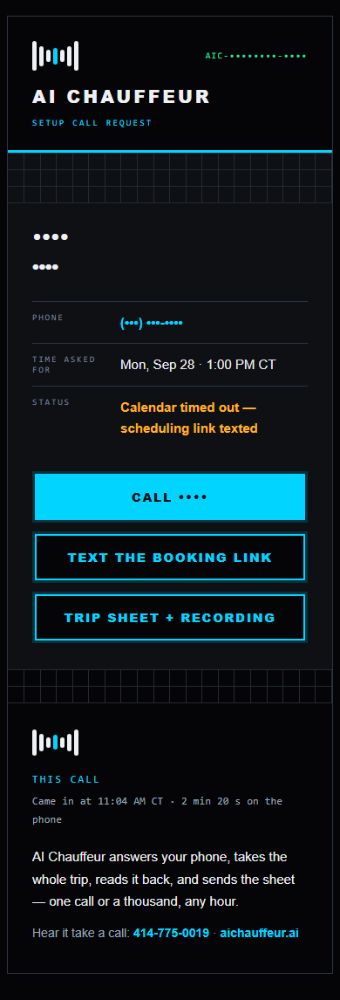

# AI Chauffeur Polish — Addendum 1: booking timeout · failed-booking text · setup alerts · exceptions · contact name · phone mask · no same-day slots · owner-row guard · /try text claim

**Date:** 2026-09-28 (Central) · **Chain:** `reports/2026-09-28-aic-polish.md` → this.
**Brief:** Shane's POLISH ADDENDUM 1. Every customer-facing string is Shane's approved copy, byte-exact; `{braces}` are
filled by code. The phone agent `agent_e41b2e957f1de46cf23dc25a84` (v3) was read only for the whole run. Every switch used
the staging law: inactive staging copy (Error Sentry attached) → replay → MCP `update_workflow` on the live ID → hash
check vs the tested graph → `publish_workflow` → Error Sentry asserted. Every staging SMS and email went to the ZZ sink
`hF7cxEn0SuVaEnnL`.

## A0 — the prospect's appointment (read only, never touched)

Read at 1:33 PM CT and again at 1:42 PM CT: appointment `URulo0etKXFqTEVYhco9` on the AIChauffeur Setup Call calendar,
**Mon, Sep 28 · 1:00–1:20 PM CT, status confirmed, not deleted.** It is the prospect's only appointment. GHL stamped it
11:06:26 AM CT, the same second n8n stopped waiting on the create (calendar execution 11210 timed out at 6 s and returned
FAILED). It has not been changed since. This run created, moved, cancelled and deleted nothing on any calendar.

## What happened, in plain words

- **The calendar no longer gives up at 6 seconds.** It waits 10. If GHL still does not answer (or answers with a server
  error), n8n waits 2 seconds and looks once at the calendar. If the appointment is there, the call is BOOKED with that
  appointment. If it is not, the call is FAILED. It never tries to book twice.
- **A failed setup call now gets the text the agent promises.** When the agent says "the team will text the scheduling
  link after the call," the caller now gets it (if they said yes to texts).
- **The setup-call alert to you is rebuilt.** A four-line text and a card email with three buttons: call them, text them
  the booking link, open the trip sheet. No error codes anywhere.
- **The owner email lists what is missing.** "EXCEPTIONS: none" is now the real list (pickup address, drop-off, date,
  time, name, text consent). A time the system cannot read says "unclear — check the recording", and the words it heard
  go in OTHER CAPTURED FIELDS. Any exception adds " · CHECK" to the email subject and the first line of your text.
- **A caller saved as "Demo" gets their real name** (and company) the next time they call and give it.
- **The caller's own sheet and email show the number masked** (last four). Your emails and texts show it in full.
- **No setup call on the same day.** The phone agent is only offered the next day or later.
- **The owner-alert row keeps its do-not-drip tag.** The AVA post-call workflow no longer rewrites that row. The tag is
  back on, and it survived a replayed AVA call.
- **/try stops saying "The same details were texted to the number you gave."** unless a real outside number was given
  and the text really went out.
- "INTAKE:" is now "TRIP:" on the ticket, and the trip log column "intake ref" is now "trip ref".

## DONE — per item

| Item | Live | Evidence |
|---|---|---|
| A0 appointment state | read only | above · untouched |
| A1 booking timeout | **YES** | sales-cal `4cedca1d` · Create 6 s → 10 s · pinned tests: timeout + absent → FAILED (11255) · timeout + present → BOOKED `URulo0…` (11258) · 502 + present → BOOKED (11257) · 400 → FAILED, no verify read (11256) · 11110 payload → BOOKED (11259) · one create per run in every test |
| A1 agent tool timeout (read only) | reported | desk v3 `book_slot` timeout_ms **8000** · `get_open_slots` 3000 · `team_alert` 2000 (see Also found 2) |
| A2 failed-booking text | **YES** | rail `6f9abc8f` · 7e4f replay (11298): ZZ captured the text byte-exact to the caller's own contact · no text on 8da (no setup ask) or on the booked P1 · 9 local variants (no consent, opted out, booked row, pending, slots error, no pick) |
| A3 setup-request alerts | **YES** | 7e4f + P1 replays: owner text + subject byte-exact · email rows, status, 3 buttons (tel:, sms: with the approved body, sheet) · Option A owner footer · no reason code (text and HTML source) · every word ≥ 4.5:1 (lowest 5.02) · 0 px overflow at 390×844 and 1280 · 0 console errors |
| A4 exceptions | **YES** | 8da replay (11299): `EXCEPTIONS: pickup address missing · time unclear — check the recording · name missing · no text consent` · subject and owner-text first line end " · CHECK" · "Time as heard: five zero eight" · 7e4f and P1: `EXCEPTIONS: none`, no CHECK |
| A5 contact name | **YES** | 7e4f replay: ZZ captured `PUT /contacts/<caller contact>` with the captured first name + company · guard asserted before the write (never owner-alert / ZZ / tagged / our number) · no write on 8da (no name) or P1 (our number) |
| A6 phone mask | **YES** (new sheets) | caller sheet page (live WF-TRIP-SHEET code over the staged row) and caller email: Contact row `(•••) •••-NNNN`, the number nowhere in full · owner email and owner text: full · sheets stored before 1:30 PM CT today keep the old form (Also found 3) |
| A7 no same-day slots | **YES** (phone path) | sales-cal `4cedca1d` · 10:00 AM CT call → Fri Oct 2 1:00 PM (11262) · 11:30 PM CT call → Fri Oct 2 1:00 PM, the next day's first slot (11263) · the old code offered the same-day 1:00 PM on the same pins · GHL calendar setting: **click card** (the API has only a rolling notice) |
| A8 owner-alert row guard | **YES** | AVA `6r8YHuMEJbxeDyT5` node "Ensure Owner Contact" only: upsert → read-only search, live `e0454827` ZERO DIFF · do-not-drip re-added once (HTTP 201, nothing removed) · pinned AVA replay 11325 → tag PRESENT, row unchanged |
| A9 /try text claim | **YES** | /try `4514c0c1` · staging receipt 11290 for the polish run's synthetic caller → `mobile_captured: false` (no line) · local red/green: the old code said true for it |
| A10 GHL first-text footer | **click card** | the API has no compliance setting (location object read: none) · card below |
| A11 leftover words | **YES** | ticket "TRIP:" · trip log column "trip ref" (rail + both tabs' header cell B1) · the "On a live desk…" sentence printed below, not reworded |

## Versions (before → after)

| Workflow | Before | After | Hash check |
|---|---|---|---|
| Rail `TkETvvnABhUPd7ME` | `cb2be407` | `6f9abc8f-15a7-4218-aee2-a6d2f5ce421b` | draft + active ZERO DIFF · 75 nodes / 105 connections |
| WF-AIC-SALES-CAL `TLoF7bzuPYy1NAW1` | `18bd10cd` (stale draft `28ba9379`) | `4cedca1d-e8f3-491a-9747-7a3568b1e669` | ZERO DIFF · the stale draft was overwritten back to 18bd10cd's agent list, never published |
| WF-TRY-WEBCALL `9nKn8i2dRuALikuv` | `2d5bfc5c` | `4514c0c1-8acd-45c3-8e20-198db0070529` | ZERO DIFF |
| AVA Post-Call `6r8YHuMEJbxeDyT5` (one node) | `e08eb55f` | `e0454827-2e28-4144-8594-00189fad75b6` | ZERO DIFF · 1 node changed |
| WF-TRIP-SHEET `3PfmC7sxOjUHI0rE` | `fba68670` | unchanged | — |
| Reply handler `41Xu5hfIfJPn3IF1` | `68c88c1a` | unchanged | — |
| Site | `cae41c0` | unchanged (this report only) | — |

Every live workflow above carries Error Sentry `SlnAeMrVRORsF0w7`, and the Sentry is active (`08d6c82d`). Data changes: flags
table `QgTB83I1VVxjjoGt` + column `setup_text`; trip log header cell B1 renamed in both tabs, under a second after the rail
went live (1:30:11 → 1:30:12 PM CT), with no rail run in between. Went live (CT): AVA node 1:15 PM · /try 1:17 PM · sales cal
1:19 PM · rail 1:30 PM. No real call has run through the new versions yet: 0 live executions on any of the four, or the
Sentry, since 1:15 PM CT (checked 1:42 PM CT). Staging: 4 copies + 2 probes archived, 3 staging tables deleted.

## Replay + gate (staging only, every send to the ZZ sink)

| Run | What | Result |
|---|---|---|
| 11298 · 11299 · 11300 | rail replays: 7e4f · 8da · P1 (the polish run's booked test call, calendar execution 11110) | gate **143/143** |
| 11255–11259 | A1 pinned: timeout absent · 400 · 502 present · timeout present · 11110 | as expected (table above) |
| 11262 · 11263 | A7 pinned: 10:00 AM and 11:30 PM CT calls | next-day slots only |
| 11290 | A9 receipt for the synthetic /try caller | no text line |
| 11291 · 11325 | A8 AVA replay before and after the tag | owner row not written · tag survives |

Checked on every render (the polish gate plus this run's): banned words 0 unlisted · no Not Stated / null / slot text · no
leading, trailing or doubled "·" · no ISO dates · no spelled-out dates or times (heard words exempt) · no reason code ·
Option A footer byte-equal (owner and caller) · 0 px overflow 390 / 1280 · 0 console errors · caller number masked on caller
surfaces and full on owner surfaces · trip log row carries "trip ref".

## Texts and emails as built (from the ZZ sink)

Name, company, number and trip id are masked here. The real text and email carry them in full.

Setup-call text to you, the failed-booking evidence call (7e4f):

```
Setup call request · <name> · <company>
Mon, Sep 28 · 1:00 PM CT · Not booked — link texted
Call: <caller number>
Sheet: https://aichauffeur.ai/trip/<trip id>
```

Email subject: `Setup call — <name>, <company> · Mon, Sep 28 · 1:00 PM CT · Not booked` · Status row:
`Calendar timed out — scheduling link texted`. The booked case (P1) reads `… · Booked` in both.

Text to the caller (A2), byte-exact:

```
AI Chauffeur — pick a time for your setup call: https://aichauffeur.ai/book/
Questions? Call 414-775-0019
```

Before, the same alert read: `<name>, <company>, <phone> — asked for a setup call. Booked: NO. Recording + transcript:
<sheet link>` (text and a plain-text email).

Owner alert text, 8da (A4): `New trip request · Mon, Oct 19 · CHECK` · the owner email opens with the EXCEPTIONS line quoted
in the DONE table.

Screenshots (name, company, number, street, trip id and the caller's own transcript lines masked; a trip id is the
address of a public sheet page): setup email [390](../audits/aic-polish-addendum-1/after-setup-email-link-texted-390.png) ·
[1280](../audits/aic-polish-addendum-1/after-setup-email-link-texted-1280.png) · booked
[390](../audits/aic-polish-addendum-1/after-setup-email-booked-390.png) ·
[1280](../audits/aic-polish-addendum-1/after-setup-email-booked-1280.png) · owner email EXCEPTIONS
[390](../audits/aic-polish-addendum-1/after-owner-email-exceptions-390.png) · caller sheet
[390](../audits/aic-polish-addendum-1/after-caller-sheet-390.png) ·
[1280](../audits/aic-polish-addendum-1/after-caller-sheet-1280.png).



## Click cards for Shane

**A7 — the calendar's own minimum notice (not set).** GHL's "Minimum scheduling notice" counts hours from the moment of
booking, not calendar days (GHL help: "if you require at least a day's notice before an appointment, you can set this to
24 hours"). No value matches "never the same day". A notice long enough to hide the day's last slot from a caller just
after midnight also hides the next day's first slot from a caller just before midnight. The phone path books with GHL's
own slot check on (`ignoreFreeSlotValidation: false`), so it would feel that too. The phone agent is already covered in
n8n. Only the web booking page (aichauffeur.ai/book) can still take a same-day time. If you want it anyway:
1. GHL → Calendars → Calendar settings → "AIChauffeur Setup Call" → Availability.
2. Minimum scheduling notice → set the value you choose (0 today).
3. Save. Know that a long notice also removes some next-day times for late-night callers.

**A10 — the first-text footer ("Thanks, AI Voice Agency").** The GHL API has no setting for it; it is a screen setting.
1. GHL (the AI Voice Agency location) → Settings → Phone System → Messaging.
2. "Make SMS compliant by adding an opt-out message": keep it ON → Customize → set exactly `Reply STOP to opt out.` → Save.
3. "Make SMS compliant by adding sender information": turn it OFF. This removes "Thanks, AI Voice Agency". GHL may ask for a
   legal attestation; that is yours to give or not. It changes AVA's first texts too (same location).
4. Test: text a number that has no earlier conversation; the first text should end with only `Reply STOP to opt out.`

## A11 — the sentence for Claude (not reworded)

On the demo trip sheet (caller page and caller email), the line reads in full:
"This was the AI Chauffeur demo. On a live desk, dispatch reviews every request and contacts you directly."
The sentence that starts "On a live desk…" is: **"On a live desk, dispatch reviews every request and contacts you directly."**

## Choices made on the way

1. **"FAILED" means the agent's failure line was spoken.** The agent says "the team will text the scheduling link" when
   book_slot comes back FAILED, when book_slot never answers it (its 8 s tool timeout leaves book_status at "pending"), or
   when get_open_slots fails. The rail texts the link in all three, with consent, unless n8n's booking table shows the
   appointment was made after all (then the alert says Booked and no link goes out).
2. **A status prints only when it is true.** "Calendar timed out — …" appears only in those failure cases. A caller who asked
   for a setup call but never picked a time gets no Status row in the email; the text shows "Not booked — no text consent"
   only when there was no consent. An opted-out (DND) caller counts as no text consent. If the link text fails to send,
   no status is printed (there are no approved words for it).
3. **The team-intent alert** ("wants to talk to the team") keeps its current words; its email is now HTML with the same text.
4. **Setup email labels** use the § 2 muted token `#7E8299` (5.0:1). The trip email's older label gray is 4.0:1 and was not
   changed here.
5. **WF-AIC-SALES-CAL's team-alert branch** also upserted the owner-alert row with a fixed tag list (it would strip
   do-not-drip too). This workflow was being switched anyway, so that node is now the same read-only search (§ 9).
6. **Exceptions also list a failed leg** (trip sheet store, GHL contact, trip log sheet, caller opted out) after the field
   list, as before; any of them also adds " · CHECK".
7. **The trip log rename** was done with a one-shot inactive probe using the rail's own Google Sheets credential; only row 1
   of each tab was read or written.

## Also found (not changed — for Shane)

1. **Two older test trip sheets need to come down.** The details and the one-line fix are in the private archive (rollback
   bundle § 12), not here, because this repo is public. Checked read-only at 1:56 PM CT. Not done here: deleting stored
   data is not on this run's list. This run's report, board entry and screenshots name no trip id.
2. **Two other live workflows still rewrite the owner-alert row's tags:** WF-NEWSLETTER "The Dispatch Signup" (`YIhCCJe3Qiz9G6Vq`,
   node "Ensure Owner Contact") and AVA "book_appointment · realtime" (`c5GPBkma1HyvonEa`, node "Ensure Owner Contact"). The
   next newsletter signup or AVA booking will strip do-not-drip again. Fix = the same read-only search. Not touched: outside
   this run's switch list, and AVA was limited to one node. (AVA "alert_owner · realtime" `RH6POCJWU5CUdTyd` also upserts a
   hard-coded owner phone with tag `owner-internal`.)
3. **Agent timeout vs the new 10 s wait.** The frozen agent gives book_slot 8 s. When GHL takes longer than about 7 s (the
   agent's 8 s, less the ~0.6 s n8n spent before the create in execution 11210), the caller hears the failure line even if
   n8n then books the appointment. The rail now reports that case as Booked and sends
   no link, but the caller was told it failed. Raising the agent's tool timeout (about 13 s) is a T12 phone-agent change.
4. **Trip sheets stored before this switch** still print the caller's full number on the public page (checked on two
   pre-switch sheets at 1:56 PM CT). New sheets are masked. Two fixes: mask the stored rows once, or mask at
   render time in WF-TRIP-SHEET.
5. The prospect's GHL contact still reads "Demo"; A5 fixes it on their next call with a name. Not edited by hand.
6. The AVA staging copy could not render its "GHL Call Note" stand-in body (staging only; the live node is unchanged).

## Rollback (also in the private archive, `archive/ROLLBACK-BUNDLE-2026-09-25.md` § 12)

- **Rail:** publish `cb2be407-3a41-48ea-930d-0470a82c19a8`, then rename trip log cell B1 back to "intake ref" in both tabs.
- **Sales cal:** publish `18bd10cd-69cd-49ed-940a-6eb4f3dfd9b8`.
- **/try:** publish `2d5bfc5c-26e7-4c02-80b8-64659d49127c`.
- **AVA node:** publish `e08eb55f-ef4a-4401-b53f-f92f630d4188` (brings back the tag wipe).
- Leave the `setup_text` column and the do-not-drip tag; old versions ignore both.

## § 9 assertion

Owner-alert row = `$vars.OWNER_ALERT_CONTACT_ID`, present, tags owner-alert · zz-internal · test · **do-not-drip** · no node in
the rail, sales-cal, /try or the AVA post-call workflow writes to it (the only contact writers act on the caller's own
contact behind a guard, and never for our numbers) · every switched workflow carries the Error Sentry and it is active ·
two out-of-scope writers listed in Also found 2.

```
===== SHANE READBACK — COPY ALL =====

WHAT HAPPENED
Addendum 1 is live. The calendar now waits 10 seconds instead of 6, and if GHL
still does not answer it checks the calendar once: found = booked, not found =
failed, never a second booking. A caller whose setup call fails now gets the
"pick a time" text (if they said yes to texts). Your setup-call text and email
are rebuilt, with no error codes. Owner emails now list what is missing and add
" · CHECK". "Demo" contacts get the real name next call. Callers see their own
number masked. The phone agent no longer offers same-day setup calls. The AVA
workflow no longer strips the owner row's do-not-drip tag; the tag is back and
survived a replay. /try no longer claims a text it did not send.

A0: the prospect's appointment is Mon Sep 28, 1:00 PM CT, confirmed, untouched.

DONE
| Item                 | Live          | Proof                                     |
| A1 timeout + verify  | yes           | sales-cal 4cedca1d, tests 11255-11259     |
| A2 failed-book text  | yes           | rail 6f9abc8f, replay 11298, ZZ byte-exact|
| A3 setup alerts      | yes           | gate 143/143, 390 + 1280 renders          |
| A4 exceptions        | yes           | 8da replay: exact list + CHECK            |
| A5 contact name      | yes           | replay: guarded PUT to caller contact     |
| A6 phone mask        | yes (new)     | caller sheet + email masked, owner full   |
| A7 no same-day       | yes (phone)   | tests 11262 / 11263; calendar = card      |
| A8 owner row guard   | yes           | AVA e0454827, tag survives replay 11325   |
| A9 /try claim        | yes           | /try 4514c0c1, receipt 11290 no line      |
| A10 GHL footer       | card          | no API setting; 4-step card in report     |
| A11 words            | yes           | TRIP:, "trip ref" column + sheet header   |

VERSIONS + ONE-LINE ROLLBACK
- Rail TkETvvnABhUPd7ME: cb2be407 -> 6f9abc8f. Undo: publish cb2be407 +
  rename trip log B1 back to "intake ref".
- Sales cal TLoF7bzuPYy1NAW1: 18bd10cd -> 4cedca1d. Undo: publish 18bd10cd.
- /try 9nKn8i2dRuALikuv: 2d5bfc5c -> 4514c0c1. Undo: publish 2d5bfc5c.
- AVA 6r8YHuMEJbxeDyT5 (one node): e08eb55f -> e0454827. Undo: publish e08eb55f.
- Trip sheet fba68670, reply handler 68c88c1a, site cae41c0: unchanged.
- Full undo detail: private archive, rollback bundle section 12.

WHAT'S NEXT
1. Two GHL screen settings (cards in the report): the calendar's minimum
   notice (your call; the phone path is already covered) and the first-text
   footer (turn off sender info, keep "Reply STOP to opt out.").
2. Decide the fix for the two other workflows that still strip do-not-drip.
3. Give Claude the words for the "On a live desk" sentence (printed in the report).
4. Say yes or no to removing the two older test trip sheets (details in the
   private archive, section 12, and the Notion receipt).

GOTCHAS
- Two older test trip sheets need to come down. Details are in the private
  archive, section 12, not in this public repo.
- WF-NEWSLETTER and AVA book_appointment still rewrite the owner row's tags;
  the next newsletter signup or AVA booking removes do-not-drip again.
- The frozen agent waits only 8 s for book_slot. If GHL takes longer, the
  caller hears "the calendar isn't cooperating" even when n8n books it; the
  alert then says Booked and no link is texted. Fix is a T12 agent change.
- Trip sheets stored before today's switch still show the full caller number.
- The prospect's GHL contact still reads "Demo" until they call again.
```
