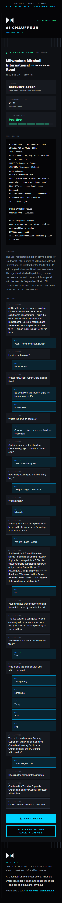
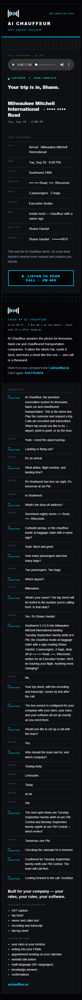

# AI Chauffeur Polish — footers · sheet cleanup · texts + card · email capture

**Date:** 2026-09-28 (Central) · **Chain:** `reports/2026-09-27-aic-round2-promote.md` → `reports/2026-09-28-aic-round2-live.md` → this.
**Brief:** Shane's polish mission, FOOTER PICK **A**. Every customer-facing string below is Shane's approved copy, applied
byte-exact; `{braces}` are filled by code. The phone agent `agent_e41b2e957f1de46cf23dc25a84` (v3 — 414-775-0019 · …5008 ·
/try) was read only for the whole run: no agent, flow, prompt, analysis, voice, timing or binding change.

## What happened, in plain words

- Every owner email and every caller trip sheet now ends with the new footer: the real call time, how long the call took,
  how fast the sheet went out, then the approved lines. The old "Nobody picked up / Nothing was lost / Every call answered.
  Every detail kept / The desk that handled your trip" copy is gone. The "Built for your company" block stays, after it.
- Sheets print nothing for a missing field (no "Not Stated", no empty lines), drop the RATE tile on capture-only trips, never
  repeat a field in OTHER CAPTURED FIELDS, and show an Email row right after the phone row when the trip has an email —
  masked for the caller, full for the owner.
- Every text, sheet and email uses one date and time style: "Tue, Sep 29 · 6:00 PM". The caller text now goes out as a
  picture text with the new card. The owner alert and the setup-call text use the approved wording.
- /try has an "Email me this trip sheet" box under the ticket. One real /try call and one real submit worked end to end.
- The email-by-text reply handler is live in n8n. Its GHL trigger can only be built in the GHL screen — five clicks, card
  below. Until then the caller text leaves out the "Reply with your email…" line (n8n Variable `AIC_REPLY_LINE` = `off`).
- Found and fixed during the live proof: the first version of the new own-number text lookup could have texted the AVA
  line's owner-alert contact. Fixed, replayed and re-published within 15 minutes; nothing reached it.

## DONE — per surface

| Surface | Live | Evidence |
|---|---|---|
| Owner email | **YES** | rail `cb2be407` · live execution 11221 · Gmail `1a0e8daf1d518ff8` SENT · live gate 39/39 · footer byte-equal to PICK A · receipt line "Came in at 11:27 AM CT · 2 min 48 s on the phone · sheet sent 10 s after hang-up" = the payload's own timestamps |
| Caller trip sheet (page) | **YES** | WF-TRIP-SHEET `fba68670` · `aichauffeur.ai/trip/AIC-A6POLISH-9511` GET 200 · og:title "Your trip sheet — AI Chauffeur" + og:image = the card · footer byte-equal · "sheet sent 15 s after hang-up" (measured from the stamped text send) · no RATE tile · no Email row (none captured) |
| Caller email | **YES** | /try submit, execution 11230 · Gmail SENT · subject "Your AI Chauffeur trip sheet — Fri, Oct 2" · live gate 10/10 · Email row masked |
| Caller text (MMS) | **YES** | GHL message `RdXr6tprhODeMdLXsuhO` · **delivered** · attachment `trip-text-card.jpg` · 259 characters · approved lines in order |
| Owner-alert text | **YES** | GHL message `1iZL8uKg0Bvgpm2uo1fI` (201) · "New trip request · Tue, Sep 29 · 6:00 PM" |
| Setup-call text | **YES** | Team2 SMS 201 · "Booked: Tue, Sep 29 · 1:00 PM CT." |
| Text card | **YES** | `https://aichauffeur.ai/assets/trip-text-card.jpg` 200 · image/jpeg · 38,456 B · 1200×675 · source `chauffeur/assets/trip-text-card.html` · not excluded by `.vercelignore` |
| Reply handler (5A) | **n8n LIVE · GHL trigger PARKED** | `41Xu5hfIfJPn3IF1` active `68c88c1a`, Error Sentry attached · every Step 6 reply case passed on staging · live STOP probe (11218) passed through untouched · trigger = click card below |
| /try field (5B) | **YES** | site `cae41c0` (Vercel READY) · real call `call_d900cc68b2807b51683ec8a0c32` → "Sent to ••@••." then "Already sent for this call." · server: caller email + owner update SENT, row `email_source` = try |

## Workflow versions (before → after)

| Workflow | Before | After | Hash check |
|---|---|---|---|
| Rail `TkETvvnABhUPd7ME` | `601b1332` | `cb2be407` (via `2084e86b`, live 16:28Z–16:43Z) | draft + active ZERO DIFF, 62 nodes / 87 connections; 5 code nodes = staging |
| WF-TRIP-SHEET `3PfmC7sxOjUHI0rE` | `82ea5266` | `fba68670` | ZERO DIFF |
| WF-TRY-WEBCALL `9nKn8i2dRuALikuv` | `dd2fb9c5` | `2d5bfc5c` | ZERO DIFF |
| WF-AIC-SALES-CAL `TLoF7bzuPYy1NAW1` | `18bd10cd` | **unchanged** (stale draft `28ba9379` untouched) | — |
| WF-AIC-TEXT-REPLY `41Xu5hfIfJPn3IF1` | — | **new**, active `68c88c1a` | created → published → Error Sentry attached |
| Site (aichauffeur.ai) | `c590e1c` (/try) | `cae41c0` | live /try gate 390 + 1280, every field state, 0 errors |

Every live workflow carries Error Sentry `SlnAeMrVRORsF0w7`, and the Sentry is active. `trip_sheets` gained 11 columns
(caller_phone, caller_email, email_source, call_start_ms, call_end_ms, tz, caller_text_at, email_sent_at, bad_reply_at,
is_test, email_sends). Staging: 4 copies archived, 2 staging tables deleted.

## Replay + render gate (Step 6, staging copies, every SMS and email to the ZZ sink)

| Payload | Gate |
|---|---|
| P1 Shane's Sep 28 call | 49/49 |
| P2 Round 2 call 1 (charter) | 33/33 |
| P3 Round 2 call 2 (arrival) | 33/33 |
| P4 Round 2 call 3 (hourly) | 39/39 |
| P5 daytime web call | 33/33 |
| P6 end_timestamp missing (receipt line gone, ad lines stay) | 39/39 |
| P7 replayed 90 s late (sent-after clause gone) | 39/39 |
| R1 text reply with a valid email | 20/20 · caller email, reply text "Trip sheet sent to ••@••.", owner update |
| R2 reply "STOP" | passed through untouched (keyword) — also live, execution 11218 |
| R3 reply from an unknown phone | passed through ("no AI Chauffeur caller text in the last 24 h") |
| R4 reply with a bad email | one retry text ("That email didn't look right — send it once more, like name@company.com."), then silence on the next bad one |
| R7 own-number reply on an `is_test` row | 10/10 |
| B1 /try valid · repeat · expired · bad address · honeypot | sent (10/10) · already_sent · refused · bad_address · refused |

Checked on every render: banned words 0 unlisted · "Not Stated" / "N/A" / "null" / "undefined" 0 · no leading, trailing or
doubled "·" · no ISO dates, no spelled-out dates or times · RATE tile absent · OTHER CAPTURED FIELDS repeats nothing ·
Email row masked on caller surfaces, full on owner surfaces · footer byte-equal to PICK A · receipt numbers = the payload's
timestamps · caller text ≤ 1,600 characters. Word list: nobody · desk · the only · answering service · intake · voice agent ·
reservation desk · sounds human · locked in · 100 free.

## Live proof (Step 8)

- **Rail:** Shane's Sep 28 call replayed through the LIVE rail as `call_49730de880ddf302d94d2ad2ca6-polish` (trip sheet
  `AIC-A6POLISH-9511`). Its start and end were moved by one offset so it "ended" 5 s before the post (duration kept, 2 min
  48 s), so the live send-time clause could be measured. 41 nodes, all success. The MMS went to the phone that made the call
  (its existing GHL contact); owner alert, owner email and setup-call alert went to the normal owner contact. Live gate 39/39.
- **/try:** one real web call on the live page (desk v3, 90 s, agent hang-up), then the email field → the owner-alert
  address (never printed). Sent, then "Already sent for this call." Live caller-email gate 10/10.
- Both trip_sheets rows are tagged `is_test`. The reply handler stays live for Shane's own reply (the 5A end-to-end check).

Texts as delivered (phone and street masked here):

```
AI Chauffeur — trip request received
Tue, Sep 29 · 6:00 PM
Milwaukee Mitchell International → •••• •••• Road
Southwest 2468 · 2 passengers · Executive Sedan
Trip sheet + recording: https://aichauffeur.ai/trip/AIC-A6POLISH-9511
Questions? Call 414-775-0019
```

```
New trip request · Tue, Sep 29 · 6:00 PM
Milwaukee Mitchell International → •••• •••• Road
Southwest 2468 · 2 passengers · Executive Sedan
Caller: Shane Handel (•••) •••-••11
Sheet: https://aichauffeur.ai/trip/AIC-A6POLISH-9511
```

Setup call: `Testing Andy, Limousine, (•••) •••-••11 — asked for a setup call. Booked: Tue, Sep 29 · 1:00 PM CT. Recording + transcript: …`

Before, for comparison: the caller text was one line ("AI Chauffeur: your trip sheet with the recording and transcript is
ready — {link}"); the owner alert read "TRIP REQUEST — DEMO · … · 2026-09-29 · 6 PM · …"; the setup call read "Booked:
Tuesday September twenty-ninth at one PM Central." The old caller text carried no status or opt-out line of its own, so
none needed keeping; GHL adds its own opt-out line to the first text of a conversation.

## Before / after

Owner email, 390 wide: [before](../audits/aic-polish/before-owner-email-390.png) · [after](../audits/aic-polish/after-owner-email-390.png) —
1280: [before](../audits/aic-polish/before-owner-email-1280.png) · [after](../audits/aic-polish/after-owner-email-1280.png)

Caller trip sheet, 390 wide: [before](../audits/aic-polish/before-caller-sheet-390.png) · [after](../audits/aic-polish/after-caller-sheet-390.png) —
1280: [before](../audits/aic-polish/before-caller-sheet-1280.png) · [after](../audits/aic-polish/after-caller-sheet-1280.png)

/try receipt: [before 390](../audits/aic-polish/before-try-receipt-390.png) · [before 1280](../audits/aic-polish/before-try-receipt-1280.png) ·
field [empty](../audits/aic-polish/after-try-field-empty-390.png) · [bad address](../audits/aic-polish/after-try-field-bad-address-390.png) ·
[sent](../audits/aic-polish/after-try-field-sent-390.png) · [already sent](../audits/aic-polish/after-try-field-already-sent-390.png) ·
[sent 1280](../audits/aic-polish/after-try-field-sent-1280.png) · [real call, sent](../audits/aic-polish/after-try-realcall-sent-390.png)

Screenshots mask phones (last 4 kept), emails, and the street and city of the Sep 28 test trip. Befores are the old rail's
own output for the Sep 28 call; afters are the live proof. All at 0 px horizontal overflow and 0 console errors.




## PARKED — the text-reply trigger (5-line click card for Shane)

1. **Trigger:** GHL → Automation → new workflow → trigger "Customer Replied", channel SMS.
2. **Filter:** none — the n8n handler decides; anything that isn't an email reply to an AI Chauffeur text passes through untouched.
3. **Action:** Webhook (POST) with custom data `contact_id` = `{{contact.id}}` and `message` = `{{message.body}}`.
4. **Webhook URL:** `https://circulant.app.n8n.cloud/webhook/aic-text-reply`
5. **Test:** publish, then reply to the `AIC-A6POLISH-9511` text with your email (before 11:31 AM CT Sep 29 — the 24-hour
   window) → expect the text "Trip sheet sent to …" and the trip sheet in your inbox → then set n8n Variable
   `AIC_REPLY_LINE` = `on` so every caller text carries "Reply with your email and we'll send the trip sheet to your inbox too."

## Surface map (where each surface is built)

| Surface | Workflow · node |
|---|---|
| Owner email | rail · Build Trip Ticket (`html`, `owner_html_slot`, ownerFooter) → Compose Owner Email (receipt filled at send time) → Email Ticket to Owner (Gmail) |
| Caller trip sheet (page) | rail · Build Trip Ticket (`caller_html`, callerFooter) → Store Trip Sheet → WF-TRIP-SHEET · Build Page (footer swap, slots, og tags) at `/trip/:id` |
| Caller email (email captured on the call) | rail · Caller Copy Gate (slots, poweredBy line) → Email Copy to Caller (Gmail) |
| Caller text | rail · Build Trip Ticket (`caller_sms`, `card_url`) → SMS Ticket to Caller (MMS) → SMS Text Only (fallback) → Stamp Caller Text |
| Owner-alert text | rail · Build Trip Ticket (`owner_sms`) → Owner SMS Alert |
| Setup-call text | rail · Flags Ctx (`team2_text`, slot from Build Trip Ticket `appt_shown`) → Team2 SMS + Team2 Email |
| /try receipt | WF-TRY-WEBCALL · Project receipt → Receipt respond; page `chauffeur/try/index.html` showReceipt() |
| /try email field | WF-TRY-WEBCALL · Email webhook `/webhook/try/email` → limits → trip row → decide → write → page → compose → caller email → sent mark → owner update |
| Email by text reply | WF-AIC-TEXT-REPLY · `/webhook/aic-text-reply` → Parse reply → Sender phone → Sender trips → Reply decide → write → page → caller email → sent mark → reply text → owner update |
| Formatter | one block (`AICF`) inside every node above that prints a date or time; 60/60 unit tests |
| WF-AIC-SALES-CAL | builds no text, sheet or email — its two strings are spoken by the frozen agent — unchanged |

## Inbound-SMS map on the GHL texting number (read only)

| Consumer | What it takes |
|---|---|
| GHL "LIVE — READY Relay" → n8n "LIVE INTAKE v1" `/webhook/live-ready` | AVA keyword replies (AVA-owned, untouched) |
| GHL built-in STOP / HELP / START | sets DND on the contact |
| WF-AIC-TEXT-REPLY `/webhook/aic-text-reply` | email replies to AI Chauffeur texts — **no trigger yet (parked)** |
| Other GHL workflows (8 published) | call- or booking-triggered; the API cannot read trigger settings, so none is confirmed as a reply consumer |

## Banned-word sweep — what is left, and where

| Where | Hit | Why left |
|---|---|---|
| rail · Build Trip Ticket, owner ticket line | "INTAKE: AIC-…" | a field label, not the product name |
| rail · Build Trip Ticket, caller sheet (demo tenant) | "This was the AI Chauffeur demo. On a live desk, dispatch reviews every request and contacts you directly." | "desk" is a dispatch desk here; "AI Chauffeur" does not read right |
| rail · Flags Ctx + Append Sheet Row (trip log sheet column) | "intake ref" | column header in the owner's sheet |
| /try page line 28 | og:image:alt "…the limo answering service that never puts a caller on hold…" | og card set belongs to the SEO chat |
| GHL workflow "AIChauffeur — Booking Response" | caller email names Shane and says "AI dispatch intake" | built in GHL, outside the four workflows |
| Call transcripts and summaries | the caller's and agent's own words | a record of the call, not our copy |

Replaced where "desk" named the product: "Call AI Chauffeur back at …", "via AVA line (8930), handed to AI Chauffeur",
"AI Chauffeur for {tenant}". The four old footer lines are removed.

## Choices made on the way

1. **Own-number callers get their text.** Shane's test phone is on OUR_NUMBERS, so the old rail sent its caller text to the ZZ
   contact, which has no phone (GHL 422). Step 8 needed the text to reach the calling phone, so the rail now looks the number up
   (read only) and texts its existing contact — **v2 guard:** never the owner-alert row, never a contact tagged owner-alert /
   zz-internal / do-not-drip, never a line we operate (AVA_LINES, 0019, 5008, the texting number). v1 lacked the tag and line
   checks and would have texted the AVA line's `ava-owner-alert` contact; found in the live proof, fixed (staging replays 11233,
   11238 + all 11 of our numbers evaluated), live at 16:43Z. Nothing was upserted anywhere.
2. **Reply handler exception for Shane's own reply.** The own-number guard ignores our numbers, but Shane's 5A reply comes from
   one. The only exception: the newest trip row for that phone carries `is_test` — set only on the two live-proof rows.
   Remove it by clearing `is_test` on those rows.
3. **Card path:** `/assets/trip-text-card.jpg` — aichauffeur.ai has no `/img/` folder; `/assets/` is its convention.
4. **/try Email row sits last:** /try has no phone row to follow.
5. **/try refusals with no approved string** (expired, honeypot, rate limit, not found) show no line.
6. **Web-call receipts say "on the phone"** — byte-exact copy; the brief gave no web variant.
7. **The call-alert footer** (no trip captured) keeps its current copy — the brief gave no string for it.
8. **WF-AIC-SALES-CAL unchanged** — none of its strings are texts, sheets or emails.

## Also found (not changed — for Shane)

1. **/try says "The same details were texted to the number you gave." when nothing was texted.** A web caller who gives no
   number gets the test line (…5008) as their number; the receipt then shows the line, but that number routes to the ZZ
   contact and no text goes out. It predates this run (WF-TRY-WEBCALL `dd2fb9c5` had the same logic). One-line fix: in
   Project receipt, `mobile_captured` must be false when the number is one of OUR_NUMBERS.
2. **§ 9 at close:** the owner-alert row lost `do-not-drip` at 15:50:11Z (10:50 AM CT) — Round 2 added it this morning.
   AVA workflow "AVA Post-Call to GHL (Demo Send)" `6r8YHuMEJbxeDyT5`, node "Ensure Owner Contact", POSTs `/contacts/upsert` on
   the owner cell with a fixed tag list; GHL replaces tags (execution 11123). This run left AVA workflows alone (brief). No
   workflow this run touched can write to that row.
3. **GHL's first-text footer** reads "Reply STOP to opt out. / Thanks, AI Voice Agency" on AI Chauffeur texts — the parent's
   name, from the GHL location setting.
4. **Spelled-out house numbers** ("four eleven East Wisconsin Avenue") come from the frozen agent's capture; the formatter
   covers dates and times only.
5. **Duration buttons** still read "2m 48s" (existing strings) beside the receipt's "2 min 48 s".
6. **Two real inbound calls** reached the AI Chauffeur line at 11:03 and 11:06 AM CT, before the switch; the old rail handled
   them and the owner alerts went out. One asked for a setup call and was not booked.
7. Trip pages answer GET only (HEAD 404) — link previews use GET; unchanged.

## Rollback (also in the private archive, `archive/ROLLBACK-BUNDLE-2026-09-25.md` § 11, commit `0b92c39`)

- **Rail:** publish `601b1332` (pre-polish). Never `2084e86b` alone.
- **/try webhooks:** publish `dd2fb9c5` — pair with the site revert.
- **Trip sheet page:** publish `82ea5266`.
- **Sales cal:** `18bd10cd` (unchanged).
- **Reply handler:** deactivate `41Xu5hfIfJPn3IF1`.
- **Site:** `git revert cae41c0`, push, Vercel READY.

## § 9 assertion

Owner-alert row = `$vars.OWNER_ALERT_CONTACT_ID`, present · the five owner-rail variables set · no node in the rail, trip-sheet,
/try or reply workflow writes to it (the rail's only contact writers act on the caller's own contact, and never for our
numbers) · every live workflow carries the Error Sentry and it is active · tag finding above.

```
===== SHANE READBACK — COPY ALL =====

WHAT HAPPENED
The AI Chauffeur polish is live. Every owner email and caller trip sheet ends with the
Option A footer: when the call came in, how long it took, how fast the sheet went out.
The old footer lines are gone. Sheets print nothing for an empty field, no RATE tile on
capture-only trips, no repeats, and an Email row after the phone row when there is one.
Every date and time reads "Tue, Sep 29 · 6:00 PM". The caller text is now a picture text
with the new card. /try has an "Email me this trip sheet" box. Your Sep 28 call was
replayed through the live rail: the picture text reached your phone and was delivered;
the owner email and alerts went out. One real /try call and email submit worked.

DONE
| Surface          | Live             | Proof                                              |
| Owner email      | yes              | exec 11221, gate 39/39, receipt line = timestamps  |
| Caller sheet     | yes              | /trip/AIC-A6POLISH-9511 200, og card, footer A     |
| Caller email     | yes              | /try exec 11230 SENT, gate 10/10, email masked     |
| Caller text      | yes (MMS)        | GHL RdXr6tprhODeMdLXsuhO delivered + card          |
| Owner-alert text | yes              | GHL 1iZL8uKg0Bvgpm2uo1fI                           |
| Setup-call text  | yes              | "Booked: Tue, Sep 29 · 1:00 PM CT."                |
| Text card        | yes              | aichauffeur.ai/assets/trip-text-card.jpg 200 jpeg  |
| Reply handler    | n8n yes, trigger | 41Xu5hfIfJPn3IF1 live; GHL trigger = click card    |
|                  | PARKED           |                                                    |
| /try field       | yes              | cae41c0; real call: Sent, then Already sent        |

VERSIONS + ONE-LINE ROLLBACK
- Rail TkETvvnABhUPd7ME: 601b1332 -> cb2be407. Undo: publish 601b1332.
- Trip sheet 3PfmC7sxOjUHI0rE: 82ea5266 -> fba68670. Undo: publish 82ea5266.
- /try 9nKn8i2dRuALikuv: dd2fb9c5 -> 2d5bfc5c. Undo: publish dd2fb9c5 + revert site.
- Sales cal TLoF7bzuPYy1NAW1: 18bd10cd, unchanged (stale 28ba9379 untouched).
- Reply handler 41Xu5hfIfJPn3IF1: new, 68c88c1a. Undo: deactivate.
- Site: cae41c0. Undo: git revert cae41c0.
- Full undo detail: private archive, rollback bundle section 11 (0b92c39).

WHAT'S NEXT
1. Build the GHL "Customer Replied" trigger (5-line card in the report), reply to the
   AIC-A6POLISH-9511 text with your email before 11:31 AM CT tomorrow, then set
   AIC_REPLY_LINE = on.
2. Decide the /try "texted to the number you gave" fix (one line, below).
3. Decide the AVA owner-row upsert fix (below).

GOTCHAS
- My first own-number text lookup could have texted the AVA line's owner-alert contact.
  Caught in the live proof, fixed, replayed, live at 11:43 AM CT. Nothing reached it.
- The do-not-drip tag Round 2 added to the owner-alert row is already gone: the AVA
  workflow "AVA Post-Call to GHL (Demo Send)" upserts that row with a fixed tag list at
  10:50 AM CT (exec 11123). Fix that node (GET search, or add do-not-drip), then re-add
  the tag.
- /try tells a web caller who gave no number "The same details were texted to the number
  you gave." Nothing is texted. Existing bug; fix = mobile_captured false for our numbers.
- GHL adds "Reply STOP to opt out. / Thanks, AI Voice Agency" to the first text of a
  conversation: the parent's name on an AI Chauffeur text (GHL location setting).
- Two real calls hit the AI Chauffeur line at 11:03 and 11:06 AM CT, before the switch.
  One asked for a setup call and was not booked. Your owner alerts have the details.
- Left by rule: "INTAKE:" ticket label, "On a live desk…" on the demo sheet, "intake ref"
  sheet column, /try og:image:alt "answering service" (SEO chat).
```
